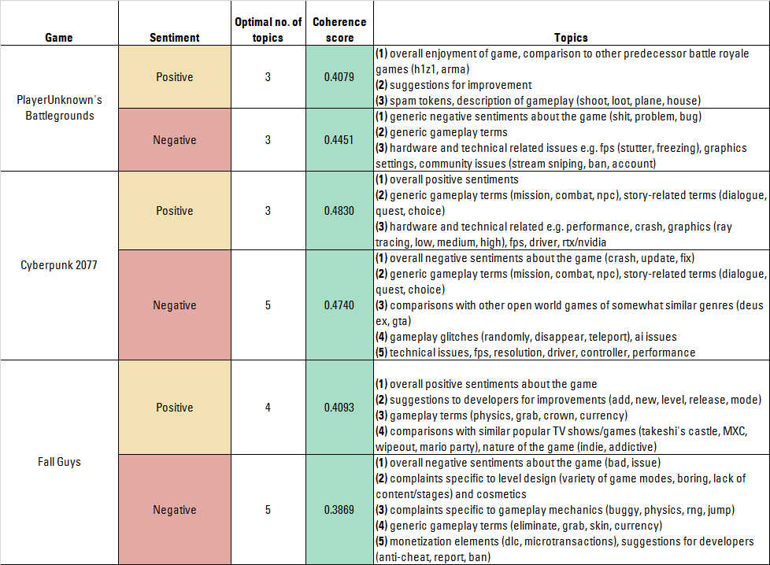

#  Sentiment Analysis and Topic Modelling of Steam game reviews

 - [Executive Summary](#Executive-Summary)
 - [Recommendations](#Recommendations)
 - [Conclusion](#Conclusion)
 - [Data Dictionary](#Data-Dictionary)
 - [Data Sources](#Data-Sources)

---
## Executive Summary
**PROBLEM STATEMENT**

The video game market is a highly competitive one, and video gamers are often spoilt for choice as developers and publishers alike compete intensely to create and publish the next big hit. 

To help better  **discern the sentiment of users' reviews**, so as to increase sales revenue and decrease the churn rate, we aim to:

-   To  **build a classification model**  and to predict if a particular game review is a  _positive_  or  _negative_  one
    -   To investigate which are the top predictive text features to determine if a review is  _positive_  or  _negative_
    -   Models to be scored on their  **ROC-AUC score**  and  **accuracy**
-   To  **perform topic modelling**  of the various reviews, segregated by their actual sentiment
    -   _Positive reviews_  - understand what people enjoy, to release future content/expansions for existing games or develop new games that recreate these aspects
    -   _Negative reviews_  - understand what aspects to improve on, release patches/bug fixes to address these issues in order for player retention
    -   Attempt topic classification of reviews to find out their dominant topic

The three games chosen for analysis, due to their immense popularity and rather polarized reviews (mixed ratings on Steam), are:
- **PlayerUnknown's Battlegrounds** (battle royale shooter)
- **Cyberpunk 2077** (open world action RPG) 
- **Fall Guys** (platformer party/battle royale game). 

**METHODOLOGY**

- Datasets was scraped from using `steamreviews` API and loaded into pandas DataFrames
- Data cleaning was performed to filter out non-English reviews using the `langdetect` library, and Regex was used to trim any hyperlinks, Steam markup codes and any remaining non-English characters
- Exploratory data analysis was carried out to investigate trends in the distribution of word count, date of review posting, number of comments etc. Word clouds for each subreddit were generated
- Lexicon-based methods using Vader and Textblob were used to generate the overall polarity of each review
- Further preprocessing was done to clean the data - dropping rows which had short `review_length`, using POS tagging with NLTK's `WordNetLemmatizer` to perform lemmatization, as well as eliminating rows which were mainly spam (repeated words)
- The data was passed into pipelines, combining `TfidfVectorizer` (used to transform the corpus of words into tf-idf vectors for modelling) and various machine learning classification algorithms (`LogisticRegression`, `MultinomialNB`, `SVC`, `LSTM`) to yield accuracy and ROC-AUC scores on the training and test sets. The best model was selected based on the best ROC-AUC score on the test set, as well as its high degree of interpretability
- Topic modelling was performed using Latent Dirichlet Allocation to discern the various topics based on positive and negative reviews for each game, as well as attempting topic classification on a subset of reviews

**KEY TAKEAWAYS AND FINDINGS**

The best performing classification model, in terms of accuracy and interpretability across all three games was **Logistic Regression**, achieving the following accuracy scores and ROC-AUC scores:

|                          Game | ROC-AUC score | Accuracy |
|:-----------------------------:|:-------------:|:--------:|
| PlayerUnknown's Battlegrounds |        0.9267 |   0.8555 |
|                Cyberpunk 2077 |        0.9578 |   0.8955 |
|                     Fall Guys |        0.9364 |   0.8683 |

Notable predictors of overall sentiment for each of the games are as shown below:

|              Game             |                       Negative                      |                    Positive                    |
|:-----------------------------:|:---------------------------------------------------:|:----------------------------------------------:|
| PlayerUnknown's Battlegrounds | money, cheater, garbage, hacker, unplayable, refund |  best, great, good, fun, love, friend, addict  |
|         Cyberpunk 2077        | refund, boring, unplayable, crash, unfinished, mess | amaze, awesome, fantastic, perfect, definitely |
|           Fall Guys           | not worth, cheater, ruin, repetitive, hacker, trash |      fun, love, friend, bean, laugh, funny     |

The topics are interpreted to be as follows:

---
## Recommendations 

To aid the developers/publisher in better understanding overall user sentiment towards their games, we recommend the following:

- For a *fast analysis*, we can consider employing **lexicon-based methods** to generate the overall polarity score of each review, to provide a quick overview for game developers on its sentiment
    - The upside of this is that no prior training of models is required
    - However, may not capture gaming terms that are specific to the game itself
    
    
- For a *deeper analysis*, **machine learning techniques** can be used to gain more insight into the top terms that reflect the overall sentiment, and typically results in better accuracy in predicting the overall sentiment of the comment/review
    - Video game sentiments usually vary widely from game to game as gamers have different considerations depending on the genre, platform the game was launched on, etc. There may be a need to train the model on games of a similar genre to obtain more accurate predictions
    - Developers/publishers can use the model to predict the sentiment of user comments on popular social media platforms and monitor the number of positive/negative reviews after an update has been rolled out. For instance,
        - If there is a large influx of reviews with 'refund', 'money' (given these were some of the top predictors of negative reviews) after a microtransaction pack is introduced - it is a signal that the company needs to quickly get things together and address some of these concerns, before players start to churn
        - On the other hand, if a new feature that is introduced (e.g. a new co-op mode) is highly popular and well-received, developers can explore incorporating more of such multiplayer modes in future games, or even variants of these modes in existing games as well
    
    
- Once a sizeable amount of reviews has been amassed, **LDA** can then be performed to sieve out more detail what gamers feel about the various positive and negative aspects of the game:
    - What features should the developers roll out next to entice new users into joining?
    - What kind of microtransactions are considered to be of fair value to gamers, such that they would consider purchasing them?
    - Whether there are bugs/glitches that were unintentionally introduced to the game after an update
    - To better understand comparisons to other popular rival games of the same genre (e.g. PUBG vs. Fortnite vs. Apex Legends) and the aspects that each game performs better at 
    
    
- **Classifying and tagging these comments by topic** would then complement and allow developers to prioritize which features to focus their efforts on

--- 
## Conclusion

Through a data science methodology comprising data collection, data cleaning, exploratory data analysis, modelling and model iteration, a **Logistic Regression** model was created that is able to classify game reviews to be of positive or negative sentiment. 

Game publishers and developers can make use of the model to predict sentiments on other popular social media platforms and use the insight to make data-driven decisions on which aspects to focus their resources and effort on, in order to bring about greater sales revenue and 

Future work to improve our analysis includes the following:
- Obtain more data for analysis
   - Improve model's generalizability to more genres by training on a larger and varied corpus of words
- Incorporate better spam and meme detection (e.g. copypastas) for data cleaning
   - Reduce the amount of noise in our training dataset
- Dealing with typos, alternate/shortform spellings of words e.g. "sux", "gd"
- Improve topic classifier by tuning hyperparameters and trying multi-label classification

--- 
## Data Dictionary

|Feature|Type|Dataset|Description|
|:-:|:-:|:-:|:--|
|**review**|*object*|`*cleaned.csv`|The main body of the review.|
|**clean_text**|*object*|`*cleaned.csv`|Pre-processed  main body and title of the post (removal of non-English characters, hyperlinks).|
|**clean_text_punct**|*object*|`*cleaned.csv`|Pre-processed  main body and title of the post (removal of non-English characters, hyperlinks). Punctuation and capitalization retained|
|**lemmed_text**|*object*|`*cleaned.csv`|Pre-processed  main body and title of the post (removal of special characters, hyperlinks). Lemmatized using NLTK's `WordNetLemmatizer` along with POS tagging|
|**label**|*int*|`*cleaned.csv`|Sentiment of the review - positive (1), negative (0)|

---
## Data Sources
The source of the datasets used in this analysis: 
- Steam
- `steamreviews` API
	- https://pypi.org/project/steamreviews/